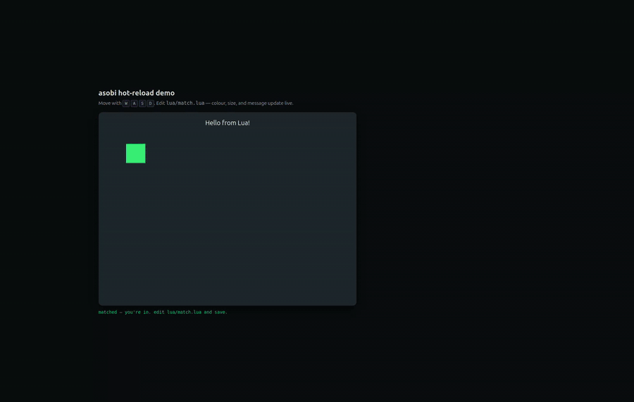

<p align="center">
  
</p>

<h1 align="center">asobi_lua</h1>

<p align="center">
  <b>Open-source game backend. Write it in Lua. Hot-reload without restart. Apache-2.</b>
</p>

<p align="center">
  <a href="https://github.com/widgrensit/asobi_lua/pkgs/container/asobi_lua"></a>
  <a href="https://github.com/widgrensit/asobi_lua/releases"></a>
  <a href="https://github.com/widgrensit/asobi_lua/actions"></a>
  <a href="LICENSE"></a>
</p>

<p align="center">
  <a href="https://asobi.dev/docs">Docs</a> •
  <a href="https://asobi.dev/demo">Live demo</a> •
  <a href="https://discord.gg/vYSfYYyXpu">Discord</a> •
  <a href="https://github.com/widgrensit/asobi_lua/issues">Issues</a>
</p>

<p align="center">
  
  <br>
  <em>Edit a Lua file. Save. Live match updates. No restart. <a href="https://github.com/widgrensit/asobi/tree/main/examples/hotreload-demo">Try it.</a></em>
</p>

---

## What is asobi_lua?

A batteries-included multiplayer game backend you write in Lua, packaged as
a single Docker image. You get auth, matchmaking, rooms, leaderboards, economy,
chat, tournaments, voting, parties, phases and seasons, reconnection, and
WebSocket + REST out of the box — and SDKs for Godot, Defold, Unity, Unreal,
JS/TS, and Flutter.

No Erlang knowledge required. Your match logic is a `.lua` file. Save it and
connected clients see the change — no restart, no redeploy.

```lua
-- lua/match.lua
match_size = 2

function init(config)
  return { players = {}, tick_count = 0 }
end

function join(player_id, state)
  state.players[player_id] = { x = 400, y = 300, hp = 100 }
  return state
end

function handle_input(player_id, input, state)
  local p = state.players[player_id]
  if input.right then p.x = p.x + 5 end
  if input.left  then p.x = p.x - 5 end
  if input.shoot then
    game.broadcast("shot", { by = player_id, at = input.aim })
  end
  return state
end

function tick(state)
  state.tick_count = state.tick_count + 1
  return state
end
```

That's a full playable room. Save the file, the match reloads in place.

## Quick Start

**1. Create the project layout**

```bash
mkdir my_game && cd my_game
mkdir -p lua
# paste the match.lua above into lua/match.lua
```

**2. Bring up Postgres + asobi_lua**

```yaml
# docker-compose.yml
services:
  postgres:
    image: postgres:17
    environment: { POSTGRES_USER: postgres, POSTGRES_PASSWORD: postgres, POSTGRES_DB: my_game }
    healthcheck: { test: ["CMD-SHELL", "pg_isready -U postgres"], interval: 5s }

  asobi:
    image: ghcr.io/widgrensit/asobi_lua:latest
    depends_on: { postgres: { condition: service_healthy } }
    ports: ["8080:8080"]
    volumes: ["./lua:/app/game:ro"]
    environment: { ASOBI_DB_HOST: postgres, ASOBI_DB_NAME: my_game }
```

```bash
docker compose up -d
```

**3. Register a player and join a match**

```bash
# Register
curl -s localhost:8080/api/v1/auth/register \
  -H 'content-type: application/json' \
  -d '{"username":"alice","password":"hunter2!"}'
# → { "username": "alice", "player_id": "019de3...", "session_token": "wRqvop92/..." }

# Queue for matchmaking
curl -s localhost:8080/api/v1/matchmaker \
  -H 'content-type: application/json' \
  -H 'authorization: Bearer wRqvop92/...' \
  -d '{"mode":"default","properties":{},"party":["019de3..."]}'
# → { "status": "pending", "ticket_id": "019de3..." }
```

Connect the WebSocket from any SDK below and the client is live. Edit
`lua/match.lua`, save, and the running match picks up the change — players
stay connected, state is preserved.

## Why asobi

- ⚡ **Hot-reload Lua** — push a fix at 11pm, your live match keeps playing. No restart, no dropped sockets.
- 🎮 **Every engine** — first-class SDKs for Godot, Defold, Unity, Unreal, plus JS/TS and Flutter.
- 🧠 **Batteries included** — matchmaker (fill + skill), rooms, economy, inventory, leaderboards, tournaments, chat, social, notifications, IAP, **voting with 4 methods** (plurality, ranked, approval, weighted), **phases**, **seasons**, reconnection.
- 🗺️ **Large-world ready** — spatial zones, lazy zone loading, terrain chunks, adaptive tick rates. Single-node by design; shard at the app level.
- 🚀 **83,000 msg/sec** sustained at 3,500 concurrent WebSockets, 4.4ms p50 RTT — see [benchmarks](https://github.com/widgrensit/asobi/blob/main/guides/benchmarks.md).
- 🛡️ **Apache-2, self-host** — use commercially, fork it, run it yourself. We will never relicense. [Exit guaranteed →](https://github.com/widgrensit/asobi/blob/main/guides/exit.md)
- 🇪🇺 **Made in the EU** — GDPR-ready, NIS2-aware, no US cloud lock-in.
- 🔒 **OTP fault tolerance** — one match crashing never touches any other match. No GC pauses during gameplay.

## Client SDKs

| Engine | Install | Docs | Sample |
|---|---|---|---|
| **Godot 4.x** | [widgrensit/asobi-godot](https://github.com/widgrensit/asobi-godot) | [guide](https://github.com/widgrensit/asobi-godot#readme) | [asobi-godot-demo](https://github.com/widgrensit/asobi-godot-demo) |
| **Defold** | [widgrensit/asobi-defold](https://github.com/widgrensit/asobi-defold) | [guide](https://github.com/widgrensit/asobi-defold#readme) | [asobi-defold-demo](https://github.com/widgrensit/asobi-defold-demo) |
| **Unity 2021.3+** | `com.asobi.sdk` (UPM via git URL) | [guide](https://github.com/widgrensit/asobi-unity#readme) | [asobi-unity-demo](https://github.com/widgrensit/asobi-unity-demo) |
| **Unreal 5** | [widgrensit/asobi-unreal](https://github.com/widgrensit/asobi-unreal) | [guide](https://github.com/widgrensit/asobi-unreal#readme) | — |
| **JS / TS** | [widgrensit/asobi-js](https://github.com/widgrensit/asobi-js) | [guide](https://github.com/widgrensit/asobi-js#readme) | — |
| **Flutter** | `dart pub add asobi` | [guide](https://github.com/widgrensit/asobi-dart#readme) | [asobi-flame-demo](https://github.com/widgrensit/asobi-flame-demo) |
| **Flame (Flutter)** | [widgrensit/flame_asobi](https://github.com/widgrensit/flame_asobi) | [guide](https://github.com/widgrensit/flame_asobi#readme) | [asobi-flame-demo](https://github.com/widgrensit/asobi-flame-demo) |

## How it works

```
  your Lua scripts (mounted at /app/game)
        │
        ▼
  asobi_lua          ── Luerl VM + bridge modules + bot runtime
        │
        ▼
  asobi (library)    ── OTP supervision, pg groups, rate limits, sessions
        │
        ▼
  Nova + Kura + PostgreSQL
```

Every match and world runs as its own BEAM process under a supervisor.
Luerl executes your Lua inside the BEAM — no sub-process, no GC pauses. The
script runs in a hardened state with `os.execute`, `os.exit`, `dofile`,
`loadfile`, `load`, `loadstring`, `io`, and `package` removed; `require/1`
is replaced by an asobi_lua-controlled implementation that resolves names
relative to your `/app/game` directory and rejects `..` traversal. Every
callback runs under a wall-clock timeout so a runaway script can't wedge
the match loop. See [SECURITY.md](SECURITY.md#sandbox-model) for the full
sandbox contract. Hot reload swaps the Luerl module while match state stays
in the process heap.

> [!NOTE]
> asobi_lua is pre-1.0. The API is stabilising; expect minor breaking changes
> until 1.0. We ship in lockstep with the [asobi library](https://github.com/widgrensit/asobi)
> (Hex.pm) and version SDKs against server tags.

## Self-host, today

Run the image wherever you like — Hetzner, Scaleway, Fly, Clever, a Raspberry
Pi, your laptop. The image is **~120MB**, cold starts in **<3s**, and holds
thousands of WebSockets on a single vCPU. Full deployment guide at
[asobi.dev/docs/deploy](https://asobi.dev/docs/deploy).

A managed cloud at **asobi.dev** is opening later in 2026 — same binary, flat
per-container pricing, never CCU-based. [Learn more →](https://asobi.dev/cloud).

## Migrating?

- [**from Hathora**](https://github.com/widgrensit/asobi/blob/main/guides/migrate-from-hathora.md) — rooms → matches, serverless processes → container. Hathora shuts down 2026-05-05.
- [**from PlayFab**](https://github.com/widgrensit/asobi/blob/main/guides/migrate-from-playfab.md) — Titles, CloudScript, Virtual Currency mapped.
- [**from Nakama self-host**](https://github.com/widgrensit/asobi/blob/main/guides/migrate-from-nakama.md) — keep your Lua runtime, lose CockroachDB.

## Documentation

- [**Lua Scripting Guide**](guides/lua-scripting.md) — callbacks, state, modules, voting, world mode
- [**Bot AI Guide**](guides/lua-bots.md) — write bots that fill matches
- [**asobi engine docs**](https://github.com/widgrensit/asobi#readme) — architecture, REST API, WebSocket protocol, benchmarks

## Community

- 💬 [Discord](https://discord.gg/vYSfYYyXpu) — chat with the team and other devs
- 🗣️ [GitHub Discussions](https://github.com/widgrensit/asobi_lua/discussions) — Q&A, show-and-tell, RFCs
- 🐛 [Issues](https://github.com/widgrensit/asobi_lua/issues) — bug reports and feature requests
- 📦 [Releases](https://github.com/widgrensit/asobi_lua/releases) — changelog and release notes

## Using asobi_lua as an Erlang library

If you're already writing Erlang/OTP and want Lua scripting as a dep:

```erlang
%% rebar.config
{deps, [
    {asobi_lua, {git, "https://github.com/widgrensit/asobi_lua.git", {tag, "v0.1.0"}}}
]}.
```

Configure game modes in your `sys.config` — see [guides/lua-scripting.md](guides/lua-scripting.md#using-with-erlang-projects).

Game-server authors writing Erlang directly should depend on the core library at
[widgrensit/asobi](https://github.com/widgrensit/asobi) instead.

## License

Apache-2.0. See [LICENSE](LICENSE).
